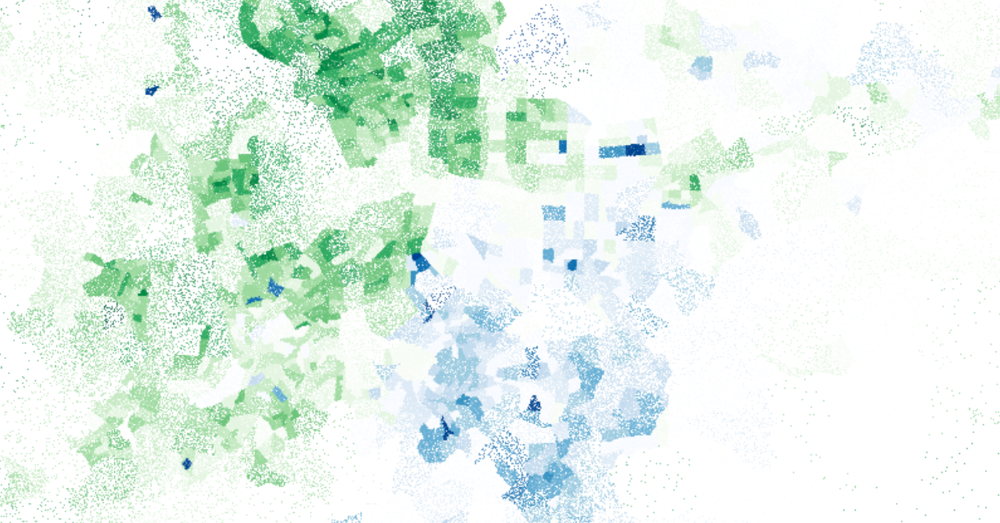

# 台灣2016總統大選地圖 Taiwan 2016 Presidential Election Dot Map



<br>

Tool  
- d3-queue v3.0.7
- d3-request v1.0.6
- mapbox-gl v1.5.1
- topojson-client v3.1.0
- webpack v4.41.2
- webpack-cli v3.3.10
- webpack-dev-server v3.9.0

<br>

Environment
- node v8.16.2
- npm v6.13.2

<br>

## Usage

<br>

Install package

```
npm install
```

<br>

serve

```
npm run start:dev
```

<br>

build

```
npm run build
```

<br>

## Workflow

<br>

1. prepare attribute data, ie some data cleaning and wrangling (R)
    1. import XLS files as a list (readr)
    2. clean, loop through and join all the files (dplyr, stringr)
    3. calculate the support rate in each region for each political camp(dplyr)

2. prepare shapefiles with attributes (QGIS)
    1. import shapefiles to QGIS (Layer => Add Layer)
    2. set projections for the shapefiles (Set CRS => Set Layer CRS...)
    3. join the attribute data with shapefiles (Properties => Joins)

3. prepare map tiles (QGIS)
    1. generate random dots in polygons (Processing Toolbox => random points inside polygons, using QGIS not later than 3.5)
    2. join attributes to dots (Vector => Data Management Tools => Join Attributes by Location...)
    3. set styles for different zoom levels (Properties => Symbology, duplicating multiple layers for different zoom levels)
    4. generate map tiles (Generate XYZ tiles, using QGIS later than 3.8)

4. prepare topojson (mapshaper)
    1. import shapefiles to mapshaper 
    2. simplify shapefiles
    3. export them in topojson format

5. design interactive map (Javascript)
    1. set the development environment (node, npm)
    2. clone samples from Mapbox GL JS examples (Mapbox GL JS)
    3. tweak the code to make it works with our own topojson files (d3js)
    4. design tooltips for different zoom levels (Mapbox GL JS)
    5. design a fly-to feature via sleecting from options (Mapbox GL JS)
    6. bring in the map tiles (Mapbox GL JS)

<br>
<br>